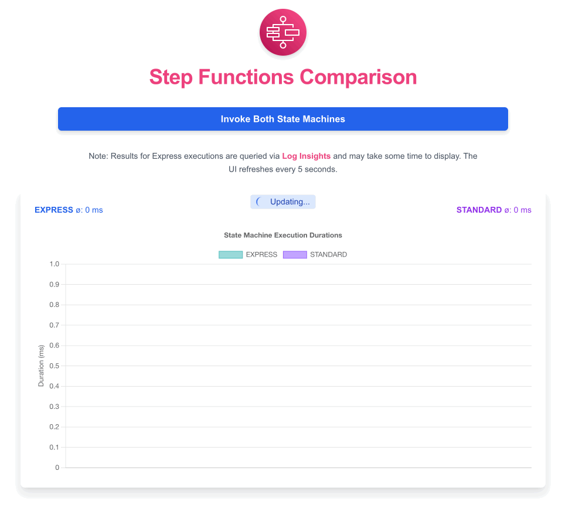

# AWS Step Functions Performance Comparison

This repository contains a simple performance comparison between Express and Standard AWS Step Functions.

## Overview

The purpose of this project is to demonstrate and analyze the performance differences between Express and Standard Step Functions in AWS. It provides a straightforward way to invoke both types of state machines and visualize their execution times.

## Features

- Invokes both Express and Standard Step Functions
- Collects execution duration data
- Displays results in a bar chart for easy comparison
- Automatically refreshes data every 5 seconds

## Technical Details

This project is built using:
- Next.js for the frontend
- AWS Lambda for backend operations
- AWS Step Functions (both Express and Standard types)
- Chart.js for data visualization
- SST (Serverless Stack) for local development and deployment

## Getting Started

1. Clone this repository
2. Install dependencies with `pnpm install`
3. Ensure you have AWS credentials configured on your machine
4. Start the local development environment with `npx sst dev`
5. Open [http://localhost:3000](http://localhost:3000) in your browser

## Note

The results for Express executions are queried via AWS CloudWatch Log Insights and may take some time to display due to potential delays in log processing.

SST Ion allows you to develop and test your serverless application locally, providing a seamless experience between local development and AWS deployment.
